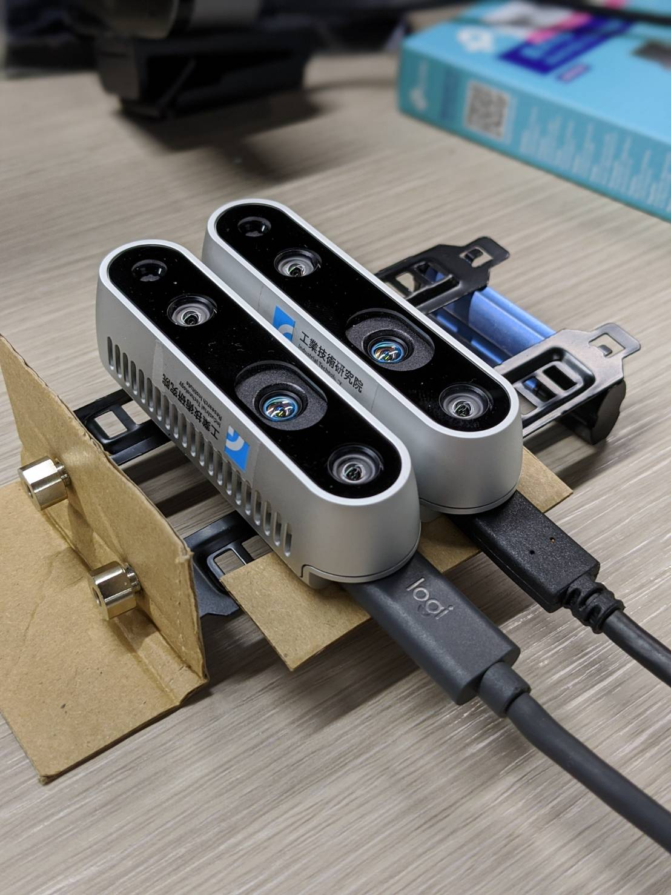

## Stereo Webcam Demo
### 1. Stereo Camera Calibration 
    python stereo_calibration.py
Currently there are two ways to do stereo camera calibrate:
1. Load the stereo images from folder [uncompleted]
2. Use D435 load the left frame and right frame directly.

##### Run Info: "[o] 2 2", 
##### 2: left frame number of detecting chessboard, 
##### 2: right frame num of detecting chessboard 

##### [o] detect chessboard corners in both left frame and right frame.
##### [x] one of frames not be detected chessboard corners.

When info show [o], you can continusely press 'S' util the info chane the number of count.

When you wanna finsh to detect chessboard, you can press "Q" to break. The calibrate will show in Info and create the pkl file on the folder.

### 2. Stereo Camera Rectify and Create Depth Frame.
    python stereo_rectify.py

Demo method:
- [x] 2*D435
- [x] 2*Image Files
- [ ] 2*Fisheyes

### Demo:

